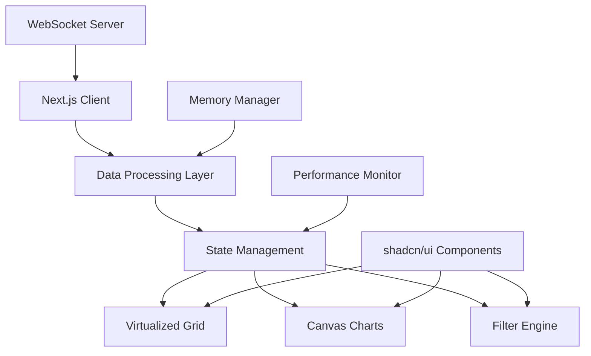

# Design Document

## Overview

The Observatory dashboard is architected as a high-performance Next.js application that handles real-time data visualization for datasets exceeding 100,000 data points. The system employs advanced optimization techniques including data virtualization, Canvas-based rendering, and efficient client-side filtering to maintain 60fps performance while providing rich interactive capabilities.

### Key Design Principles

- **Performance First**: Every component is designed with performance as the primary constraint
- **Incremental Rendering**: Only render what's visible and update only what's changed
- **Memory Efficiency**: Implement sliding windows and garbage collection strategies
- **Responsive Architecture**: Maintain sub-200ms response times for all user interactions
- **Scalable State Management**: Handle complex filter states and real-time updates efficiently

## Architecture

### High-Level System Architecture



### Technology Stack

- **Framework**: Next.js 14+ with App Router for optimal performance and SEO
- **UI Components**: shadcn/ui for consistent, accessible design system
- **Virtualization**: react-virtuoso for high-performance list/grid virtualization
- **Charts**: D3.js with HTML5 Canvas for maximum rendering performance
- **State Management**: Zustand for lightweight, performant state management
- **WebSocket**: Native WebSocket API with custom reconnection logic
- **Styling**: Tailwind CSS integrated with shadcn/ui
- **Performance**: React.memo, useMemo, useCallback for optimization

## Components and Interfaces

### Core Components

#### 1. DataStreamProvider
```typescript
interface DataStreamProvider {
  connection: WebSocket | null;
  connectionStatus: 'connecting' | 'connected' | 'disconnected' | 'error';
  dataBuffer: DataPoint[];
  subscribe: (callback: (data: DataPoint[]) => void) => void;
  reconnect: () => void;
}
```

**Responsibilities:**
- Establish and maintain WebSocket connection
- Handle automatic reconnection with exponential backoff
- Manage data buffer with sliding window (max 100,000 points)
- Provide real-time data to consuming components

#### 2. VirtualizedDataGrid
```typescript
interface VirtualizedDataGridProps {
  data: DataPoint[];
  columns: ColumnDefinition[];
  onRowSelect?: (row: DataPoint) => void;
  height: number;
  filterCriteria?: FilterCriteria;
}
```

**Responsibilities:**
- Render only visible rows using react-virtuoso
- Handle dynamic row heights and column resizing
- Provide smooth scrolling for large datasets
- Integrate with filtering system

#### 3. CanvasTimeSeriesChart
```typescript
interface CanvasTimeSeriesChartProps {
  data: DataPoint[];
  width: number;
  height: number;
  xScale: d3.ScaleTime<number, number>;
  yScale: d3.ScaleLinear<number, number>;
  onZoom?: (transform: d3.ZoomTransform) => void;
  onHover?: (dataPoint: DataPoint | null) => void;
}
```

**Responsibilities:**
- Render time-series data to HTML5 Canvas
- Handle zoom, pan, and hover interactions
- Implement efficient partial redraws
- Provide tooltip functionality

#### 4. AdvancedFilterBuilder
```typescript
interface FilterCondition {
  id: string;
  field: string;
  operator: 'eq' | 'gt' | 'lt' | 'contains' | 'between';
  value: any;
  logicalOperator?: 'AND' | 'OR';
}

interface AdvancedFilterBuilderProps {
  conditions: FilterCondition[];
  onConditionsChange: (conditions: FilterCondition[]) => void;
  availableFields: FieldDefinition[];
}
```

**Responsibilities:**
- Provide visual query builder interface
- Support complex logical expressions with grouping
- Validate filter conditions in real-time
- Export/import filter configurations

### Data Models

#### DataPoint Interface
```typescript
interface DataPoint {
  id: string;
  timestamp: Date;
  value: number;
  category: string;
  metadata: Record<string, any>;
  source: string;
}
```

#### FilterCriteria Interface
```typescript
interface FilterCriteria {
  conditions: FilterCondition[];
  grouping: FilterGroup[];
  sortBy?: {
    field: string;
    direction: 'asc' | 'desc';
  };
}
```

## Data Models

### State Management Architecture

Using Zustand for lightweight, performant state management:

```typescript
interface DashboardStore {
  // Data State
  rawData: DataPoint[];
  filteredData: DataPoint[];
  
  // Connection State
  connectionStatus: ConnectionStatus;
  
  // Filter State
  filterCriteria: FilterCriteria;
  
  // UI State
  selectedRows: string[];
  chartZoomLevel: number;
  
  // Actions
  addDataPoints: (points: DataPoint[]) => void;
  updateFilterCriteria: (criteria: FilterCriteria) => void;
  setConnectionStatus: (status: ConnectionStatus) => void;
}
```

### Performance Optimizations

#### 1. Data Processing Pipeline
- **Streaming Buffer**: Maintain sliding window of 100,000 most recent points
- **Incremental Updates**: Append new data without full re-processing
- **Background Processing**: Use Web Workers for heavy computations
- **Memory Management**: Implement garbage collection for old data points

#### 2. Rendering Optimizations
- **Canvas Rendering**: Use HTML5 Canvas for charts to avoid DOM overhead
- **Virtualization**: Render only visible table rows and chart segments
- **Memoization**: Extensive use of React.memo, useMemo, and useCallback
- **Debounced Updates**: Batch rapid filter changes to prevent excessive re-renders

#### 3. Filter Engine Optimization
```typescript
class FilterEngine {
  private indexedData: Map<string, DataPoint[]>;
  
  constructor(data: DataPoint[]) {
    this.buildIndices(data);
  }
  
  filter(criteria: FilterCriteria): DataPoint[] {
    // Use indexed lookups for categorical filters
    // Implement binary search for numeric ranges
    // Cache filter results for repeated queries
  }
}
```

## Error Handling

### WebSocket Error Recovery
- **Connection Loss**: Automatic reconnection with exponential backoff
- **Data Corruption**: Validate incoming data and discard invalid points
- **Buffer Overflow**: Implement sliding window to prevent memory issues
- **Rate Limiting**: Handle server-side rate limits gracefully

### UI Error Boundaries
```typescript
class DashboardErrorBoundary extends React.Component {
  // Catch rendering errors in charts and grids
  // Provide fallback UI for failed components
  // Log errors for debugging
  // Allow partial functionality to continue
}
```

### Performance Monitoring
- **Frame Rate Monitoring**: Track rendering performance
- **Memory Usage**: Monitor heap size and garbage collection
- **Network Metrics**: Track WebSocket message rates and latency
- **User Interaction Latency**: Measure response times for user actions

## Data Generation and Testing Strategy

### Mock Data Generation

#### Large Dataset Creation
```typescript
interface DataGenerator {
  generateHistoricalData(count: number): DataPoint[];
  generateRealtimeStream(): AsyncGenerator<DataPoint[], void, unknown>;
  generateWithPatterns(patterns: DataPattern[]): DataPoint[];
}
```

**Historical Data Sources:**
- **Financial Market Data**: Use Yahoo Finance API or Alpha Vantage for realistic time-series patterns
- **System Metrics Simulation**: Generate CPU, memory, network metrics with realistic fluctuations
- **IoT Sensor Data**: Simulate temperature, pressure, humidity readings with seasonal patterns
- **Custom Generator**: Create configurable data generator with:
  - Trending patterns (linear, exponential, cyclical)
  - Seasonal variations
  - Random noise and outliers
  - Multiple data categories and sources

#### Real-Time Data Simulation

**WebSocket Mock Server:**
```typescript
class MockDataServer {
  private interval: NodeJS.Timeout;
  private clients: Set<WebSocket>;
  
  startStreaming(ratePerSecond: number = 100) {
    // Generate realistic streaming data
    // Support burst patterns and quiet periods
    // Simulate network latency and occasional drops
  }
  
  simulateScenarios() {
    // High-load scenarios (1000+ points/second)
    // Network interruption scenarios
    // Data spike scenarios
    // System degradation patterns
  }
}
```

**Data Patterns for Testing:**
- **High Frequency**: 1000+ data points per second for stress testing
- **Bursty Traffic**: Periods of high activity followed by quiet periods
- **Gradual Growth**: Slowly increasing data volume to test memory management
- **Anomaly Injection**: Introduce outliers and edge cases
- **Multi-Source**: Simulate data from multiple systems/sensors

### Performance Validation Dataset

#### Benchmark Datasets
1. **Small Dataset**: 1,000 points for baseline performance
2. **Medium Dataset**: 10,000 points for typical usage
3. **Large Dataset**: 100,000 points for stress testing
4. **Extreme Dataset**: 500,000+ points for breaking point analysis

#### Real-World Data Sources (Optional)
- **Public APIs**: 
  - OpenWeatherMap for weather data
  - CoinGecko for cryptocurrency prices
  - GitHub API for repository statistics
- **CSV Datasets**: 
  - Kaggle datasets for realistic data patterns
  - Government open data portals
  - Financial market historical data

### Testing Strategy

#### Unit Testing
- **Data Processing**: Test filter engine with various dataset sizes
- **Component Logic**: Test individual component behavior with mock data
- **State Management**: Test Zustand store with large data volumes
- **Utility Functions**: Test D3 scale calculations, data validation

#### Integration Testing
- **WebSocket Integration**: Use mock WebSocket server with configurable scenarios
- **Component Integration**: Test data flow with realistic data volumes
- **Performance Testing**: Measure rendering performance with benchmark datasets
- **Filter Combinations**: Test complex filters on large datasets

#### Performance Testing
- **Load Testing**: Test with 100,000+ data points using generated datasets
- **Memory Profiling**: Monitor memory usage during extended streaming
- **Rendering Benchmarks**: Maintain 60fps with performance datasets
- **Network Simulation**: Test with various connection qualities and data rates

#### Stress Testing Scenarios
```typescript
interface StressTestScenario {
  name: string;
  dataPointsPerSecond: number;
  duration: number;
  expectedPerformance: PerformanceMetrics;
}

const stressTests: StressTestScenario[] = [
  {
    name: "High Frequency Streaming",
    dataPointsPerSecond: 1000,
    duration: 300, // 5 minutes
    expectedPerformance: { fps: 60, memoryGrowth: "<100MB" }
  },
  {
    name: "Extended Operation",
    dataPointsPerSecond: 100,
    duration: 3600, // 1 hour
    expectedPerformance: { fps: 60, memoryLeaks: false }
  }
];
```

### Browser Compatibility
- **Modern Browsers**: Chrome 90+, Firefox 88+, Safari 14+
- **Canvas Support**: Ensure HTML5 Canvas compatibility
- **WebSocket Support**: Test WebSocket implementation across browsers
- **Performance Validation**: Verify performance across different devices and screen sizes

## Data Infrastructure

### Development Environment Setup

#### Mock Data Server
```typescript
// Development server for realistic data simulation
class DevelopmentDataServer {
  constructor() {
    this.setupWebSocketServer();
    this.initializeDataGenerators();
  }
  
  // Generate initial 100k historical data points
  seedHistoricalData(): DataPoint[] {
    return this.generateTimeSeriesData({
      startDate: new Date(Date.now() - 30 * 24 * 60 * 60 * 1000), // 30 days ago
      endDate: new Date(),
      pointsPerHour: 138, // ~100k points over 30 days
      categories: ['cpu', 'memory', 'network', 'disk'],
      sources: ['server-1', 'server-2', 'server-3', 'database', 'cache']
    });
  }
  
  // Stream real-time data with configurable patterns
  startRealtimeStream(config: StreamConfig) {
    // Normal operation: 10-50 points/second
    // Burst scenarios: 500-1000 points/second
    // Maintenance windows: 0-5 points/second
  }
}
```

#### Data Generation Strategies
1. **Algorithmic Generation**: Mathematical functions for predictable patterns
2. **Template-Based**: Use real data patterns as templates for generation
3. **Hybrid Approach**: Combine real data samples with generated variations
4. **Scenario-Based**: Generate data for specific testing scenarios

### Production Data Integration Options

#### Real Data Sources
- **System Metrics**: Integrate with monitoring systems (Prometheus, Grafana)
- **Business Metrics**: Connect to analytics platforms or databases
- **IoT Data**: Interface with sensor networks or device management platforms
- **Financial Data**: Use market data feeds for realistic time-series patterns
- **Public APIs**: Weather data, cryptocurrency prices, social media metrics

#### Data Privacy and Security
- **Anonymization**: Ensure sensitive data is properly anonymized
- **Sampling**: Use representative samples rather than full production datasets
- **Synthetic Data**: Generate realistic synthetic data based on production patterns

## Deployment Considerations

### Next.js Optimization
- **Static Generation**: Pre-render dashboard shell for fast initial load
- **Code Splitting**: Lazy load chart and grid components
- **Bundle Analysis**: Optimize bundle size for performance
- **CDN Integration**: Serve static assets from CDN

### Development vs Production Data
- **Development**: Use mock server with configurable data generation
- **Staging**: Use anonymized production data samples
- **Production**: Connect to real data sources with appropriate security measures

### Monitoring and Observability
- **Real-time Metrics**: Monitor dashboard performance in production
- **Error Tracking**: Capture and analyze client-side errors
- **User Analytics**: Track usage patterns and performance bottlenecks
- **Data Quality Monitoring**: Track data freshness, completeness, and accuracy
- **Performance Alerting**: Set up alerts for performance degradation