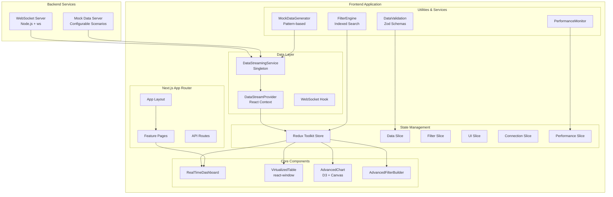

# Observatory Dashboard - Comprehensive Design Document

## Overview

The Observatory Dashboard is a high-performance, real-time data visualization platform built with Next.js 15, designed to handle streaming datasets exceeding 100,000 data points while maintaining 60fps performance. The system employs advanced optimization techniques including data virtualization, Canvas-based rendering, unified data streaming, and efficient client-side filtering to provide rich interactive capabilities for monitoring large-scale infrastructure and business metrics.

### Key Design Principles

- **Performance First**: Every component is designed with performance as the primary constraint, utilizing React optimization patterns and efficient rendering strategies
- **Unified Data Architecture**: Single source of truth for all data streaming with centralized state management
- **Incremental Rendering**: Only render what's visible and update only what's changed using virtualization and memoization
- **Memory Efficiency**: Implement sliding windows, garbage collection strategies, and buffer management
- **Responsive Architecture**: Maintain sub-200ms response times for all user interactions
- **Scalable State Management**: Handle complex filter states and real-time updates efficiently using Redux Toolkit
- **Modular Component Design**: Reusable, testable components with clear separation of concerns
- **Real-time Resilience**: Automatic reconnection, fallback mechanisms, and graceful degradation

## Architecture

### High-Level System Architecture



### Technology Stack

#### Core Framework & Runtime
- **Framework**: Next.js 15.5.0 with App Router for optimal performance, SSR, and modern React features
- **Runtime**: React 19.1.0 with concurrent features and automatic batching
- **TypeScript**: 5.x for type safety and developer experience
- **Node.js**: Backend services with WebSocket support

#### UI & Styling
- **UI Components**: shadcn/ui (Radix UI primitives) for accessible, customizable design system
- **Styling**: Tailwind CSS 4.x with CSS variables and utility-first approach
- **Icons**: Lucide React for consistent iconography
- **Responsive Design**: Mobile-first approach with breakpoint-based layouts

#### Data Visualization & Performance
- **Charts**: D3.js 7.9.0 with HTML5 Canvas for high-performance rendering
- **Virtualization**: react-window for efficient large dataset rendering
- **Data Processing**: Custom algorithms with indexing and caching strategies

#### State Management & Data Flow
- **State Management**: Redux Toolkit 2.8.2 with RTK Query for efficient state updates
- **Data Streaming**: Custom WebSocket service with automatic reconnection
- **Data Validation**: Zod 3.25.76 for runtime type checking and schema validation
- **Caching**: Multi-level caching (memory, filter results, computed values)

#### Development & Testing
- **Testing**: Jest 30.0.5 + React Testing Library 16.3.0 for comprehensive testing
- **Linting**: ESLint 9.x with Next.js and Prettier configurations
- **Type Checking**: Strict TypeScript with path mapping and module resolution
- **Build Tools**: Next.js built-in bundling with SWC compiler

#### Performance & Monitoring
- **Bundle Analysis**: Built-in Next.js analyzer for optimization
- **Performance Monitoring**: Custom hooks for FPS, memory, and render time tracking
- **Error Handling**: Comprehensive error boundaries and graceful degradation
- **Memory Management**: Automatic garbage collection and buffer size limits

## Components and Interfaces

### Core Architecture Components

#### 1. DataStreamingService (Singleton)
```typescript
interface DataStreamingService {
  // Connection Management
  connect(): Promise<void>;
  disconnect(): void;
  getStatus(): StreamingStatus;
  
  // Data Management
  getBufferedData(): DataPoint[];
  clearBuffer(): void;
  addDataPoints(points: DataPoint[]): void;
  
  // Event Listeners
  onData(callback: (data: DataPoint[]) => void): () => void;
  onStatusChange(callback: (status: StreamingStatus) => void): () => void;
  onMetricsUpdate(callback: (metrics: StreamingMetrics) => void): () => void;
  
  // Configuration
  updateConfig(config: Partial<StreamingConfig>): void;
  changeScenario(scenario: DataScenario): void;
  
  // Testing Utilities
  simulateDataSpike(duration?: number, multiplier?: number): void;
  injectTestData(data: DataPoint[]): void;
}
```

**Responsibilities:**
- Unified data streaming across the entire application
- WebSocket connection management with automatic reconnection
- Mock data generation with configurable scenarios
- Buffer management with sliding window (10,000 points default)
- Event-driven architecture for real-time updates
- Fallback to mock data when WebSocket unavailable

#### 2. DataStreamProvider (React Context)
```typescript
interface DataStreamContextValue {
  // Data Access
  data: DataPoint[];
  recentData: DataPoint[];
  filteredData: DataPoint[];
  
  // Status & Metrics
  status: StreamingStatus;
  isConnected: boolean;
  metrics: StreamingMetrics | null;
  
  // Controls
  connect(): Promise<void>;
  disconnect(): void;
  clearBuffer(): void;
  
  // Data Utilities
  getDataByCategory(category: string): DataPoint[];
  getDataBySource(source: string): DataPoint[];
  getLatestDataPoints(count: number): DataPoint[];
}
```

**Responsibilities:**
- React Context wrapper for DataStreamingService
- Provides hooks for component data access
- Manages UI-specific data transformations
- Handles React lifecycle integration

#### 3. Redux Store Architecture
```typescript
interface RootState {
  data: DataState;
  filter: FilterState;
  ui: UIState;
  connection: ConnectionState;
  performance: PerformanceState;
}

interface DataState {
  rawData: DataPoint[];
  filteredData: DataPoint[];
  dataBuffer: DataPoint[];
  lastUpdate: Date | null;
}

interface FilterState {
  filterCriteria: FilterCriteria;
  activeFilters: FilterCondition[];
  filterCache: Map<string, number[]>;
}
```

**Responsibilities:**
- Centralized state management with Redux Toolkit
- Slice-based architecture for modularity
- Middleware for filter processing and performance monitoring
- Optimized selectors with memoization

#### 4. VirtualizedTable Component
```typescript
interface VirtualizedTableProps {
  data: DataPoint[];
  columns: ColumnDefinition[];
  height?: number;
  onRowSelect?: (row: DataPoint) => void;
  onRowDoubleClick?: (row: DataPoint) => void;
  className?: string;
}

interface ColumnDefinition {
  key: keyof DataPoint | string;
  label: string;
  width?: number;
  sortable?: boolean;
  formatter?: (value: unknown, row: DataPoint) => React.ReactNode;
  accessor?: (row: DataPoint) => unknown;
}
```

**Responsibilities:**
- High-performance virtualization using react-window
- Dynamic column configuration and sorting
- Row selection with multi-select support (Ctrl/Cmd, Shift)
- Custom cell formatters and accessors
- Smooth scrolling for 100k+ rows with minimal DOM elements

#### 5. AdvancedChart Component
```typescript
interface AdvancedChartProps {
  data: DataPoint[];
  width: number;
  height: number;
  config?: Partial<ChartConfiguration>;
  syncConfig?: Partial<ChartSyncConfiguration>;
  chartId?: string;
  onHover?: (dataPoint: DataPoint | null) => void;
  onZoom?: (transform: d3.ZoomTransform) => void;
  enableZoom?: boolean;
  enablePan?: boolean;
  showGrid?: boolean;
  showCrosshair?: boolean;
  showTooltip?: boolean;
}

interface ChartConfiguration {
  type: 'line' | 'area' | 'scatter' | 'bar';
  colors: ChartColors;
  style: ChartStyle;
  aggregation?: AggregationConfig;
  downsampling?: DownsamplingConfig;
}
```

**Responsibilities:**
- Canvas-based rendering with D3.js for maximum performance
- Multiple chart types (line, area, scatter, bar)
- Interactive features (zoom, pan, hover, crosshair)
- Chart synchronization across multiple instances
- Efficient partial redraws for real-time updates
- Data processing pipeline with aggregation and downsampling

#### 6. AdvancedFilterEngine
```typescript
interface AdvancedFilterEngine {
  setData(data: DataPoint[]): void;
  addData(newPoints: DataPoint[]): void;
  filter(criteria: FilterCriteria): DataPoint[];
  getStats(): FilterEngineStats;
}

interface FilterCriteria {
  conditions: FilterCondition[];
  grouping: FilterGroup[];
  sortBy?: SortConfiguration;
}

interface FilterCondition {
  id: string;
  field: string;
  operator: FilterOperator;
  value: any;
  logicalOperator?: LogicalOperator;
}
```

**Responsibilities:**
- High-performance client-side filtering with indexing
- Support for complex logical operations (AND/OR grouping)
- Multiple filter operators (eq, gt, lt, contains, between, in, not_in)
- Filter result caching and optimization
- Date range filtering with timestamp indices
- Performance monitoring and statistics

#### 7. MockDataGenerator
```typescript
interface DataGenerationConfig {
  startDate?: Date;
  endDate?: Date;
  pointsPerHour?: number;
  categories?: string[];
  sources?: string[];
  patterns?: Record<string, DataPattern>;
  seasonality?: SeasonalityConfig;
  anomalies?: AnomalyConfig;
}

interface DataPattern {
  type: 'linear' | 'exponential' | 'cyclical' | 'sine' | 'random' | 'gaussian' | 'brownian' | 'chaos';
  amplitude?: number;
  frequency?: number;
  noise?: number;
  trend?: number;
}
```

**Responsibilities:**
- Realistic data generation with configurable patterns
- Multiple pattern types (mathematical, statistical, chaotic)
- Seasonality simulation (daily, weekly, monthly cycles)
- Anomaly injection for testing edge cases
- Scenario-based configurations (normal, high_load, system_failure, etc.)
- Performance benchmarking utilities

### Data Models and Type System

#### Core Data Types
```typescript
// Primary data structure for all streaming data
interface DataPoint {
  id: string;                    // Unique identifier
  timestamp: Date | string;      // ISO string for serialization, Date for processing
  value: number;                 // Numeric measurement value
  category: string;              // Data category (cpu, memory, network, etc.)
  metadata: Record<string, any>; // Extensible metadata object
  source: string;                // Data source identifier
}

// Filter system types
interface FilterCondition {
  id: string;
  field: string;
  operator: FilterOperator;
  value: any;
  logicalOperator?: LogicalOperator;
}

interface FilterGroup {
  id: string;
  conditions: FilterCondition[];
  logicalOperator: LogicalOperator;
  parentGroupId?: string;
}

interface FilterCriteria {
  conditions: FilterCondition[];
  grouping: FilterGroup[];
  sortBy?: SortConfiguration;
}

// Performance and metrics types
interface PerformanceMetrics {
  fps: number;
  memoryUsage: number;
  dataPointsPerSecond: number;
  renderTime: number;
  filterTime: number;
  networkLatency?: number;
}

interface StreamingMetrics {
  totalDataPoints: number;
  dataPointsPerSecond: number;
  connectionUptime: number;
  lastUpdateTime: Date | null;
  bufferUtilization: number;
  memoryUsage: number;
}
```

#### Type Definitions and Enums
```typescript
// Filter operators for different data types
type FilterOperator = 'eq' | 'gt' | 'lt' | 'gte' | 'lte' | 'contains' | 'between' | 'in' | 'not_in';

// Logical operators for combining conditions
type LogicalOperator = 'AND' | 'OR';

// Connection status for real-time streaming
type ConnectionStatus = 'connecting' | 'connected' | 'disconnected' | 'error';

// Data scenarios for testing and simulation
type DataScenario = 'normal' | 'high_load' | 'system_failure' | 'maintenance' | 'peak_hours' | 'weekend';

// Chart types supported by AdvancedChart
type ChartType = 'line' | 'area' | 'scatter' | 'bar';

// Field types for filter builder
type FieldType = 'string' | 'number' | 'date' | 'boolean' | 'category';
```

#### Validation Schemas (Zod)
```typescript
// Runtime validation schemas using Zod
export const DataPointSchema = z.object({
  id: z.string().min(1),
  timestamp: z.string(),
  value: z.number().finite(),
  category: z.string().min(1),
  metadata: z.record(z.any()).default({}),
  source: z.string().min(1)
});

export const FilterConditionSchema = z.object({
  id: z.string().min(1),
  field: z.string().min(1),
  operator: z.enum(['eq', 'gt', 'lt', 'gte', 'lte', 'contains', 'between', 'in', 'not_in']),
  value: z.any(),
  logicalOperator: z.enum(['AND', 'OR']).optional()
});

export const PerformanceMetricsSchema = z.object({
  fps: z.number().min(0).max(120),
  memoryUsage: z.number().min(0),
  dataPointsPerSecond: z.number().min(0),
  renderTime: z.number().min(0),
  filterTime: z.number().min(0)
});
```

## State Management Architecture

### Redux Toolkit Store Structure

The application uses Redux Toolkit for centralized state management with a slice-based architecture:

```typescript
// Root store configuration
export const store = configureStore({
  reducer: {
    data: dataReducer,
    filter: filterReducer,
    ui: uiReducer,
    connection: connectionReducer,
    performance: performanceReducer
  },
  middleware: (getDefaultMiddleware) =>
    getDefaultMiddleware({
      serializableCheck: {
        ignoredActions: ['connection/setLastConnected'],
        ignoredPaths: ['connection.lastConnected', 'data.rawData']
      }
    }).prepend(filterMiddleware.middleware)
});

// Data slice for managing streaming data
interface DataState {
  rawData: DataPoint[];
  filteredData: DataPoint[];
  dataBuffer: DataPoint[];
  lastUpdate: Date | null;
  isLoading: boolean;
}

// Filter slice for advanced filtering
interface FilterState {
  filterCriteria: FilterCriteria;
  activeFilters: FilterCondition[];
  filterResults: number[];
  filterCache: Map<string, number[]>;
  isFiltering: boolean;
}

// UI slice for interface state
interface UIState {
  selectedRows: string[];
  chartZoomLevel: number;
  sidebarOpen: boolean;
  activeTab: string;
  isLoading: boolean;
  error: string | null;
}

// Connection slice for streaming status
interface ConnectionState {
  connectionStatus: ConnectionStatus;
  lastConnected: Date | null;
  reconnectAttempts: number;
  error: string | null;
}

// Performance slice for monitoring
interface PerformanceState {
  metrics: PerformanceMetrics;
  history: PerformanceMetrics[];
  alerts: PerformanceAlert[];
}
```

### Middleware and Side Effects

```typescript
// Filter middleware for automatic filter processing
const filterMiddleware = createListenerMiddleware();

filterMiddleware.startListening({
  actionCreator: updateFilterCriteria,
  effect: async (action, listenerApi) => {
    const state = listenerApi.getState() as RootState;
    const { data } = state.data;
    const { filterCriteria } = action.payload;
    
    // Apply filters using the filter engine
    const filteredData = filterEngine.filter(filterCriteria);
    listenerApi.dispatch(setFilteredData(filteredData));
  }
});

// Performance monitoring middleware
const performanceMiddleware = createListenerMiddleware();

performanceMiddleware.startListening({
  matcher: isAnyOf(addDataPoints, setFilteredData),
  effect: (action, listenerApi) => {
    const metrics = collectPerformanceMetrics();
    listenerApi.dispatch(updatePerformanceMetrics(metrics));
  }
});
```

### Selector Patterns and Optimization

```typescript
// Memoized selectors for performance
export const selectFilteredData = createSelector(
  [(state: RootState) => state.data.rawData, (state: RootState) => state.filter.filterCriteria],
  (rawData, filterCriteria) => {
    return filterEngine.filter(filterCriteria);
  }
);

export const selectRecentData = createSelector(
  [(state: RootState) => state.data.rawData, (_, count: number) => count],
  (rawData, count) => rawData.slice(-count)
);

export const selectDataByCategory = createSelector(
  [(state: RootState) => state.data.rawData, (_, category: string) => category],
  (rawData, category) => rawData.filter(point => point.category === category)
);

// Hook-based selectors for components
export const useRawData = () => useAppSelector(state => state.data.rawData);
export const useFilteredData = () => useAppSelector(selectFilteredData);
export const useConnectionStatus = () => useAppSelector(state => state.connection.connectionStatus);
export const usePerformanceMetrics = () => useAppSelector(state => state.performance.metrics);
```

### Performance Optimizations

#### 1. Data Processing Pipeline
- **Unified Streaming Service**: Single DataStreamingService instance manages all data flow
- **Sliding Window Buffer**: Maintain configurable buffer size (default 10,000 points) with automatic cleanup
- **Incremental Updates**: Append new data without full re-processing using efficient array operations
- **Data Validation**: Runtime validation with Zod schemas for data integrity
- **Memory Management**: Automatic garbage collection and buffer size monitoring

#### 2. Rendering Optimizations
- **Canvas-Based Charts**: HTML5 Canvas with D3.js for maximum rendering performance
- **Virtualization**: react-window for table rendering (only 20-50 DOM elements for 100k+ rows)
- **React Optimization**: Extensive use of React.memo, useMemo, useCallback, and React 19 features
- **Partial Redraws**: Charts only redraw changed portions using efficient diffing algorithms
- **Animation Frames**: RequestAnimationFrame for smooth interactive updates
- **Component Lazy Loading**: Code splitting and dynamic imports for non-critical components

#### 3. Advanced Filter Engine
```typescript
class AdvancedFilterEngine {
  private dataIndices: Map<string, Map<any, Set<number>>> = new Map();
  private filterCache: Map<string, number[]> = new Map();
  
  // Multi-level indexing strategy
  buildIndices(): void {
    // Index by category, source, timestamp ranges
    // Create composite indices for common filter combinations
    // Use Set data structures for fast intersection operations
  }
  
  filter(criteria: FilterCriteria): DataPoint[] {
    // 1. Check cache for identical queries
    // 2. Use indexed lookups for exact matches
    // 3. Binary search for numeric ranges
    // 4. Intersection/union operations for complex logic
    // 5. Cache results for future queries
  }
  
  // Performance monitoring
  getStats(): FilterEngineStats {
    return {
      dataSize: this.data.length,
      indexSize: this.dataIndices.size,
      cacheHitRate: this.cacheHits / this.totalQueries,
      averageFilterTime: this.totalFilterTime / this.filterCount
    };
  }
}
```

#### 4. Memory Management Strategies
```typescript
// Automatic buffer management
class BufferManager {
  private maxSize: number = 10000;
  private cleanupThreshold: number = 0.9;
  
  addData(newPoints: DataPoint[]): void {
    this.buffer.push(...newPoints);
    
    if (this.buffer.length > this.maxSize * this.cleanupThreshold) {
      this.cleanup();
    }
  }
  
  private cleanup(): void {
    // Remove oldest 20% of data
    const removeCount = Math.floor(this.maxSize * 0.2);
    this.buffer.splice(0, removeCount);
    
    // Trigger garbage collection hint
    if (window.gc) window.gc();
  }
}
```

#### 5. Network and Connection Optimization
```typescript
// Resilient WebSocket with fallback
class ResilientConnection {
  private reconnectAttempts: number = 0;
  private maxAttempts: number = 5;
  private backoffMultiplier: number = 1.5;
  
  async connect(): Promise<void> {
    try {
      await this.connectWebSocket();
    } catch (error) {
      // Automatic fallback to mock data
      this.startMockDataGeneration();
    }
  }
  
  private handleReconnection(): void {
    const delay = Math.min(
      1000 * Math.pow(this.backoffMultiplier, this.reconnectAttempts),
      30000 // Max 30 seconds
    );
    
    setTimeout(() => this.connect(), delay);
  }
}
```

#### 6. Component-Level Optimizations
```typescript
// Memoized components with shallow comparison
const VirtualizedTable = memo(({ data, columns, ...props }) => {
  // Memoize expensive calculations
  const sortedData = useMemo(() => 
    applySorting(data, sortState), [data, sortState]
  );
  
  // Debounce rapid updates
  const debouncedFilter = useDebouncedCallback(
    (criteria) => dispatch(updateFilter(criteria)),
    200
  );
  
  // Virtualization with overscan for smooth scrolling
  return (
    <FixedSizeList
      itemCount={sortedData.length}
      itemSize={50}
      overscanCount={10}
      width="100%"
      height={height}
    >
      {MemoizedRow}
    </FixedSizeList>
  );
});

// Chart optimization with efficient redraws
const AdvancedChart = memo(({ data, config }) => {
  const canvasRef = useRef<HTMLCanvasElement>(null);
  
  // Only redraw when necessary
  const renderChart = useCallback(() => {
    if (!canvasRef.current) return;
    
    const ctx = canvasRef.current.getContext('2d');
    // Efficient partial redraw logic
    clearDirtyRegions(ctx);
    drawUpdatedElements(ctx, data);
  }, [data]);
  
  // Use animation frame for smooth updates
  useEffect(() => {
    const frameId = requestAnimationFrame(renderChart);
    return () => cancelAnimationFrame(frameId);
  }, [renderChart]);
});
```

## Error Handling and Resilience

### Comprehensive Error Recovery System

#### 1. WebSocket Connection Resilience
```typescript
class ResilientWebSocket {
  private reconnectAttempts: number = 0;
  private maxReconnectAttempts: number = 5;
  private reconnectBackoffMultiplier: number = 1.5;
  private maxReconnectInterval: number = 30000;
  
  async connect(): Promise<void> {
    try {
      await this.establishConnection();
      this.resetReconnectState();
    } catch (error) {
      await this.handleConnectionFailure(error);
    }
  }
  
  private async handleConnectionFailure(error: Error): Promise<void> {
    console.warn('WebSocket connection failed:', error);
    
    if (this.reconnectAttempts < this.maxReconnectAttempts) {
      const delay = this.calculateBackoffDelay();
      setTimeout(() => this.connect(), delay);
      this.reconnectAttempts++;
    } else {
      // Fallback to mock data generation
      console.log('Max reconnection attempts reached, switching to mock data');
      this.startMockDataFallback();
    }
  }
  
  private startMockDataFallback(): void {
    this.setStatus('connected'); // Show as connected for UX
    this.mockDataService.start();
  }
}
```

#### 2. Data Validation and Sanitization
```typescript
class DataValidationService {
  validateIncomingData(rawData: unknown[]): {
    valid: DataPoint[];
    invalid: ValidationError[];
  } {
    const results = { valid: [], invalid: [] };
    
    rawData.forEach((item, index) => {
      try {
        const validated = DataPointSchema.parse(item);
        
        // Additional business logic validation
        if (this.isReasonableValue(validated)) {
          results.valid.push(validated);
        } else {
          results.invalid.push({
            index,
            error: 'Value outside reasonable bounds',
            data: item
          });
        }
      } catch (error) {
        results.invalid.push({
          index,
          error: error.message,
          data: item
        });
      }
    });
    
    return results;
  }
  
  private isReasonableValue(dataPoint: DataPoint): boolean {
    // Category-specific validation
    const bounds = this.getCategoryBounds(dataPoint.category);
    return dataPoint.value >= bounds.min && dataPoint.value <= bounds.max;
  }
}
```

#### 3. UI Error Boundaries with Recovery
```typescript
class DashboardErrorBoundary extends React.Component<
  ErrorBoundaryProps,
  ErrorBoundaryState
> {
  constructor(props: ErrorBoundaryProps) {
    super(props);
    this.state = { hasError: false, error: null, errorInfo: null };
  }
  
  static getDerivedStateFromError(error: Error): Partial<ErrorBoundaryState> {
    return { hasError: true, error };
  }
  
  componentDidCatch(error: Error, errorInfo: React.ErrorInfo) {
    // Log error to monitoring service
    this.logErrorToService(error, errorInfo);
    
    this.setState({ errorInfo });
  }
  
  render() {
    if (this.state.hasError) {
      return (
        <ErrorFallbackComponent
          error={this.state.error}
          onRetry={() => this.setState({ hasError: false, error: null })}
          onReportIssue={() => this.reportIssue()}
        />
      );
    }
    
    return this.props.children;
  }
  
  private logErrorToService(error: Error, errorInfo: React.ErrorInfo): void {
    // Send to error tracking service (e.g., Sentry)
    console.error('Dashboard Error:', error, errorInfo);
  }
}

// Specialized error boundaries for different components
const ChartErrorBoundary = ({ children }) => (
  <ErrorBoundary fallback={<ChartErrorFallback />}>
    {children}
  </ErrorBoundary>
);

const TableErrorBoundary = ({ children }) => (
  <ErrorBoundary fallback={<TableErrorFallback />}>
    {children}
  </ErrorBoundary>
);
```

#### 4. Performance Monitoring and Alerting
```typescript
class PerformanceMonitor {
  private metrics: PerformanceMetrics = {
    fps: 60,
    memoryUsage: 0,
    dataPointsPerSecond: 0,
    renderTime: 0,
    filterTime: 0
  };
  
  private alerts: PerformanceAlert[] = [];
  
  startMonitoring(): void {
    // FPS monitoring
    this.monitorFrameRate();
    
    // Memory usage monitoring
    this.monitorMemoryUsage();
    
    // Render time monitoring
    this.monitorRenderPerformance();
    
    // Network latency monitoring
    this.monitorNetworkLatency();
  }
  
  private monitorFrameRate(): void {
    let lastTime = performance.now();
    let frameCount = 0;
    
    const measureFPS = () => {
      frameCount++;
      const currentTime = performance.now();
      
      if (currentTime - lastTime >= 1000) {
        this.metrics.fps = frameCount;
        
        if (this.metrics.fps < 30) {
          this.triggerAlert('low_fps', `FPS dropped to ${this.metrics.fps}`);
        }
        
        frameCount = 0;
        lastTime = currentTime;
      }
      
      requestAnimationFrame(measureFPS);
    };
    
    requestAnimationFrame(measureFPS);
  }
  
  private monitorMemoryUsage(): void {
    if ('memory' in performance) {
      const memInfo = (performance as any).memory;
      this.metrics.memoryUsage = memInfo.usedJSHeapSize / 1024 / 1024; // MB
      
      if (this.metrics.memoryUsage > 100) { // 100MB threshold
        this.triggerAlert('high_memory', `Memory usage: ${this.metrics.memoryUsage.toFixed(1)}MB`);
      }
    }
  }
  
  private triggerAlert(type: string, message: string): void {
    const alert: PerformanceAlert = {
      id: Date.now().toString(),
      type,
      message,
      timestamp: new Date(),
      severity: this.getAlertSeverity(type)
    };
    
    this.alerts.push(alert);
    this.notifyAlertListeners(alert);
  }
}
```

#### 5. Graceful Degradation Strategies
```typescript
class GracefulDegradationService {
  private performanceLevel: 'high' | 'medium' | 'low' = 'high';
  
  adjustPerformanceLevel(metrics: PerformanceMetrics): void {
    if (metrics.fps < 30 || metrics.memoryUsage > 100) {
      this.performanceLevel = 'low';
      this.applyLowPerformanceMode();
    } else if (metrics.fps < 45 || metrics.memoryUsage > 50) {
      this.performanceLevel = 'medium';
      this.applyMediumPerformanceMode();
    } else {
      this.performanceLevel = 'high';
      this.applyHighPerformanceMode();
    }
  }
  
  private applyLowPerformanceMode(): void {
    // Reduce chart update frequency
    this.chartUpdateInterval = 1000; // 1 second
    
    // Limit data points in charts
    this.maxChartPoints = 1000;
    
    // Disable animations
    this.animationsEnabled = false;
    
    // Reduce virtualization overscan
    this.virtualizationOverscan = 2;
  }
  
  private applyMediumPerformanceMode(): void {
    this.chartUpdateInterval = 500; // 500ms
    this.maxChartPoints = 5000;
    this.animationsEnabled = true;
    this.virtualizationOverscan = 5;
  }
  
  private applyHighPerformanceMode(): void {
    this.chartUpdateInterval = 100; // 100ms
    this.maxChartPoints = 10000;
    this.animationsEnabled = true;
    this.virtualizationOverscan = 10;
  }
}
```

#### 6. User-Friendly Error Messages
```typescript
const ErrorFallbackComponent = ({ error, onRetry, onReportIssue }) => (
  <Card className="m-4 p-6 border-red-200 bg-red-50">
    <div className="flex items-center space-x-2 mb-4">
      <AlertTriangle className="w-5 h-5 text-red-600" />
      <h3 className="text-lg font-semibold text-red-800">
        Something went wrong
      </h3>
    </div>
    
    <p className="text-red-700 mb-4">
      We encountered an unexpected error while loading this component.
      Your data is safe and other parts of the dashboard should continue working.
    </p>
    
    <div className="flex space-x-3">
      <Button onClick={onRetry} variant="outline">
        <RotateCcw className="w-4 h-4 mr-2" />
        Try Again
      </Button>
      
      <Button onClick={onReportIssue} variant="outline">
        <Bug className="w-4 h-4 mr-2" />
        Report Issue
      </Button>
    </div>
    
    {process.env.NODE_ENV === 'development' && (
      <details className="mt-4">
        <summary className="cursor-pointer text-sm text-red-600">
          Technical Details
        </summary>
        <pre className="mt-2 text-xs bg-red-100 p-2 rounded overflow-auto">
          {error?.stack}
        </pre>
      </details>
    )}
  </Card>
);
```

## Project Structure and Organization

### Frontend Application Structure
```
observatory-dashboard/
├── src/
│   ├── app/                          # Next.js App Router
│   │   ├── layout.tsx               # Root layout with providers
│   │   ├── page.tsx                 # Dashboard home page
│   │   ├── globals.css              # Global styles with Tailwind
│   │   └── features/                # Feature-specific pages
│   │       ├── real-time-dashboard/
│   │       ├── advanced-charts/
│   │       ├── virtualized-data-grid/
│   │       ├── advanced-filtering/
│   │       └── performance-monitoring/
│   │
│   ├── components/                   # Reusable UI components
│   │   ├── ui/                      # shadcn/ui base components
│   │   ├── charts/                  # Chart components and utilities
│   │   │   ├── AdvancedChart.tsx
│   │   │   ├── TimeSeriesChart.tsx
│   │   │   ├── CanvasChart.tsx
│   │   │   └── utils/
│   │   ├── dashboard/               # Dashboard-specific components
│   │   │   ├── RealTimeDashboard.tsx
│   │   │   ├── VirtualizedTable.tsx
│   │   │   └── DashboardLayout.tsx
│   │   ├── filters/                 # Filter system components
│   │   │   ├── AdvancedFilterBuilder.tsx
│   │   │   └── FilterPanel.tsx
│   │   └── navigation/              # Navigation components
│   │
│   ├── hooks/                       # Custom React hooks
│   │   ├── useWebSocket.ts
│   │   ├── useDataStream.ts
│   │   ├── useAdvancedFilter.ts
│   │   └── usePerformanceMonitor.ts
│   │
│   ├── stores/                      # Redux store and slices
│   │   ├── store.ts                 # Store configuration
│   │   ├── dashboardStore.ts        # Main store exports
│   │   ├── slices/                  # Redux slices
│   │   │   ├── dataSlice.ts
│   │   │   ├── filterSlice.ts
│   │   │   ├── uiSlice.ts
│   │   │   ├── connectionSlice.ts
│   │   │   └── performanceSlice.ts
│   │   └── middleware/              # Custom middleware
│   │
│   ├── services/                    # Business logic services
│   │   └── dataStreamingService.ts  # Unified streaming service
│   │
│   ├── providers/                   # React context providers
│   │   └── DataStreamProvider.tsx   # Global data stream context
│   │
│   ├── lib/                        # Utility libraries
│   │   ├── utils.ts                # General utilities
│   │   ├── filterEngine.ts         # Advanced filtering logic
│   │   ├── dataValidation.ts       # Data validation utilities
│   │   └── errorRecovery.ts        # Error recovery utilities
│   │
│   ├── utils/                      # Data generation and testing
│   │   ├── mockDataGenerator.ts    # Comprehensive data generation
│   │   ├── mockWebSocketServer.ts  # WebSocket simulation
│   │   └── performanceBenchmark.ts # Performance testing
│   │
│   └── types/                      # TypeScript type definitions
│       ├── index.ts                # Core types and interfaces
│       └── schemas.ts              # Zod validation schemas
│
├── __tests__/                      # Test files (Jest + RTL)
├── public/                         # Static assets
├── .next/                         # Next.js build output
├── node_modules/                  # Dependencies
├── package.json                   # Project configuration
├── tsconfig.json                  # TypeScript configuration
├── next.config.ts                 # Next.js configuration
├── postcss.config.mjs            # PostCSS configuration
├── components.json               # shadcn/ui configuration
└── jest.config.js               # Jest test configuration
```

### Backend Services Structure
```
mock-backend/
├── server.js                     # WebSocket server with mock data
├── package.json                  # Backend dependencies
└── node_modules/                 # Backend dependencies
```

### Configuration Files
- **Next.js**: Modern React framework with App Router
- **TypeScript**: Strict type checking with path mapping
- **Tailwind CSS**: Utility-first styling with shadcn/ui integration
- **Jest + RTL**: Comprehensive testing setup
- **ESLint + Prettier**: Code quality and formatting

## Data Generation and Testing Strategy

### Advanced Mock Data Generation System

#### Comprehensive Data Generator
```typescript
interface DataGenerationConfig {
  startDate?: Date;
  endDate?: Date;
  pointsPerHour?: number;
  categories?: string[];
  sources?: string[];
  patterns?: Record<string, DataPattern>;
  seasonality?: SeasonalityConfig;
  anomalies?: AnomalyConfig;
  correlations?: CorrelationConfig[];
}

interface DataPattern {
  type: 'linear' | 'exponential' | 'cyclical' | 'sine' | 'cosine' | 'sawtooth' | 
        'square' | 'random' | 'gaussian' | 'brownian' | 'fibonacci' | 'chaos';
  amplitude?: number;
  frequency?: number;
  phase?: number;
  offset?: number;
  trend?: number;
  decay?: number;
  noise?: number;
  volatility?: number;
  mean?: number;
  stdDev?: number;
  persistence?: number;
  lyapunovExponent?: number;
}
```

#### Realistic Data Scenarios
```typescript
// Pre-configured scenarios for different testing needs
export function createScenarioConfig(scenario: DataScenario): DataGenerationConfig {
  switch (scenario) {
    case 'normal':
      return {
        categories: ['cpu', 'memory', 'network', 'disk', 'temperature'],
        sources: ['web-server-1', 'web-server-2', 'database', 'cache'],
        patterns: {
          cpu: { type: 'sine', amplitude: 15, frequency: 0.1, offset: 35, noise: 0.05 },
          memory: { type: 'linear', trend: 0.001, offset: 45, noise: 0.03 },
          network: { type: 'cyclical', amplitude: 20, frequency: 0.2, offset: 30 }
        },
        seasonality: {
          enabled: true,
          dailyPattern: { type: 'sine', amplitude: 10, frequency: 1 }
        },
        anomalies: { enabled: true, probability: 0.005, intensity: 2 }
      };
      
    case 'high_load':
      return {
        patterns: {
          cpu: { type: 'linear', trend: 0.01, offset: 60, noise: 0.1 },
          memory: { type: 'exponential', trend: 0.002, offset: 70 },
          network: { type: 'random', amplitude: 30, offset: 80, noise: 0.2 }
        },
        anomalies: { enabled: true, probability: 0.02, intensity: 4 }
      };
      
    case 'system_failure':
      return {
        patterns: {
          cpu: { type: 'random', amplitude: 40, offset: 90, noise: 0.3 },
          memory: { type: 'step', amplitude: 20, offset: 95 },
          network: { type: 'sawtooth', amplitude: 50, frequency: 0.5 }
        },
        anomalies: { enabled: true, probability: 0.1, intensity: 8 }
      };
  }
}
```

#### WebSocket Mock Server with Advanced Features
```typescript
class EnhancedMockServer {
  private config = {
    categories: ['cpu', 'memory', 'network', 'disk', 'temperature'],
    sources: ['server-1', 'server-2', 'server-3', 'database', 'cache'],
    dataPointsPerSecond: 10,
    burstMode: false,
    burstMultiplier: 5
  };
  
  startDataGeneration(): void {
    const intervalMs = 1000 / this.config.dataPointsPerSecond;
    
    setInterval(() => {
      const dataPoints = this.generateBatch();
      this.broadcastToClients(dataPoints);
    }, intervalMs);
  }
  
  private generateBatch(): DataPoint[] {
    const batch: DataPoint[] = [];
    
    // Generate realistic data for each category/source combination
    for (const category of this.config.categories) {
      for (const source of this.config.sources) {
        const dataPoint = this.generateRealisticDataPoint(category, source);
        batch.push(dataPoint);
      }
    }
    
    return batch;
  }
  
  // Handle client commands for testing scenarios
  handleClientMessage(message: any): void {
    switch (message.type) {
      case 'config':
        Object.assign(this.config, message.config);
        break;
      case 'command':
        this.executeCommand(message.command);
        break;
    }
  }
  
  private executeCommand(command: string): void {
    switch (command) {
      case 'start_burst':
        this.simulateBurstTraffic();
        break;
      case 'simulate_failure':
        this.simulateSystemFailure();
        break;
      case 'inject_anomalies':
        this.injectAnomalies();
        break;
    }
  }
}
```

#### Data Pattern Library
```typescript
// Mathematical patterns for realistic data generation
const PATTERN_LIBRARY = {
  // System monitoring patterns
  cpu_normal: { type: 'sine', amplitude: 20, frequency: 0.1, offset: 40, noise: 0.05 },
  cpu_stressed: { type: 'linear', trend: 0.02, offset: 70, noise: 0.15 },
  
  memory_gradual: { type: 'linear', trend: 0.001, offset: 50, noise: 0.02 },
  memory_leak: { type: 'exponential', trend: 0.005, offset: 60, noise: 0.03 },
  
  network_bursty: { type: 'square', amplitude: 40, frequency: 0.3, offset: 30 },
  network_steady: { type: 'gaussian', mean: 0, stdDev: 1, amplitude: 10, offset: 25 },
  
  // Business metrics patterns
  revenue_seasonal: { type: 'sine', amplitude: 1000, frequency: 0.1, offset: 5000 },
  users_growth: { type: 'exponential', trend: 0.001, offset: 2000, noise: 0.1 },
  
  // Chaotic patterns for stress testing
  chaos_logistic: { type: 'chaos', lyapunovExponent: 3.7, amplitude: 50, offset: 50 },
  brownian_walk: { type: 'brownian', persistence: 0.2, amplitude: 30, offset: 50 }
};
```

### Comprehensive Testing Strategy

#### Performance Validation Datasets
```typescript
// Benchmark datasets for different testing scenarios
export function generatePerformanceTestData(testType: string): DataPoint[] {
  switch (testType) {
    case 'memory_stress':
      return generateLargeDataset(100000); // 100k points
      
    case 'rendering_stress':
      return generateHistoricalData(50000, {
        patterns: {
          cpu: { type: 'random', amplitude: 50, noise: 0.3 },
          memory: { type: 'sawtooth', amplitude: 40, frequency: 0.5 }
        }
      });
      
    case 'filter_stress':
      return generateHistoricalData(75000, {
        categories: ['cpu', 'memory', 'network', 'disk', 'temperature', 'bandwidth', 'latency'],
        sources: ['web-1', 'web-2', 'db-1', 'db-2', 'cache-1', 'cache-2'],
        anomalies: { enabled: true, probability: 0.05, intensity: 5 }
      });
      
    case 'streaming_stress':
      return generateTimeSeriesData({
        pointsPerHour: 3600, // 1 point per second
        duration: 3600000 // 1 hour
      });
  }
}

// Performance benchmarking utilities
export function benchmarkDataGeneration(size: number): BenchmarkResults {
  const iterations = 5;
  const times: number[] = [];
  
  for (let i = 0; i < iterations; i++) {
    const startTime = performance.now();
    generateLargeDataset(size);
    const endTime = performance.now();
    times.push(endTime - startTime);
  }
  
  return {
    averageTime: times.reduce((sum, time) => sum + time, 0) / times.length,
    minTime: Math.min(...times),
    maxTime: Math.max(...times),
    pointsPerSecond: size / (averageTime / 1000)
  };
}
```

#### Multi-Level Testing Architecture
```typescript
// Unit Tests - Component isolation
describe('VirtualizedTable', () => {
  it('renders only visible rows for large datasets', () => {
    const largeDataset = generateLargeDataset(100000);
    render(<VirtualizedTable data={largeDataset} height={400} />);
    
    // Should only render ~20 DOM elements regardless of data size
    expect(screen.getAllByTestId('table-row')).toHaveLength(20);
  });
});

// Integration Tests - Component interaction
describe('RealTimeDashboard Integration', () => {
  it('handles high-frequency data updates without performance degradation', async () => {
    const mockService = new MockDataStreamingService();
    mockService.setDataRate(1000); // 1000 points/second
    
    render(<RealTimeDashboard />);
    
    // Monitor performance during high-frequency updates
    const performanceMonitor = new PerformanceMonitor();
    performanceMonitor.start();
    
    await waitFor(() => {
      expect(performanceMonitor.getFPS()).toBeGreaterThan(30);
    }, { timeout: 5000 });
  });
});

// Performance Tests - System limits
describe('Performance Benchmarks', () => {
  it('maintains 60fps with 100k data points', () => {
    const dataset = generateLargeDataset(100000);
    const chart = new AdvancedChart({ data: dataset });
    
    const fps = measureRenderingFPS(chart, 5000); // 5 second test
    expect(fps).toBeGreaterThan(60);
  });
  
  it('filters 100k records in under 200ms', () => {
    const dataset = generateLargeDataset(100000);
    const filterEngine = new AdvancedFilterEngine(dataset);
    
    const startTime = performance.now();
    const results = filterEngine.filter({
      conditions: [{ field: 'category', operator: 'eq', value: 'cpu' }]
    });
    const endTime = performance.now();
    
    expect(endTime - startTime).toBeLessThan(200);
    expect(results.length).toBeGreaterThan(0);
  });
});

// Stress Tests - Breaking point analysis
describe('Stress Testing', () => {
  const stressScenarios = [
    { name: 'High Volume', dataPoints: 500000, duration: 300000 },
    { name: 'High Frequency', rate: 2000, duration: 60000 },
    { name: 'Memory Pressure', dataPoints: 1000000, memoryLimit: 200 }
  ];
  
  stressScenarios.forEach(scenario => {
    it(`handles ${scenario.name} scenario`, async () => {
      const monitor = new SystemMonitor();
      monitor.start();
      
      // Execute stress scenario
      await executeStressScenario(scenario);
      
      const metrics = monitor.getMetrics();
      expect(metrics.memoryLeaks).toBe(false);
      expect(metrics.averageFPS).toBeGreaterThan(30);
    });
  });
});
```

#### Browser Compatibility and Device Testing
```typescript
// Cross-browser testing configuration
const browserTargets = [
  { name: 'Chrome', version: '90+', features: ['WebSocket', 'Canvas', 'WebWorkers'] },
  { name: 'Firefox', version: '88+', features: ['WebSocket', 'Canvas', 'WebWorkers'] },
  { name: 'Safari', version: '14+', features: ['WebSocket', 'Canvas'] },
  { name: 'Edge', version: '90+', features: ['WebSocket', 'Canvas', 'WebWorkers'] }
];

// Device performance testing
const deviceProfiles = [
  { name: 'High-end Desktop', cpu: 'fast', memory: '16GB', expected: { fps: 60, loadTime: 2000 } },
  { name: 'Mid-range Laptop', cpu: 'medium', memory: '8GB', expected: { fps: 45, loadTime: 4000 } },
  { name: 'Low-end Device', cpu: 'slow', memory: '4GB', expected: { fps: 30, loadTime: 8000 } }
];

// Automated performance regression testing
class PerformanceRegressionSuite {
  async runBenchmarks(): Promise<BenchmarkResults> {
    const results = {
      dataGeneration: await this.benchmarkDataGeneration(),
      rendering: await this.benchmarkRendering(),
      filtering: await this.benchmarkFiltering(),
      memory: await this.benchmarkMemoryUsage()
    };
    
    // Compare against baseline performance
    this.compareWithBaseline(results);
    
    return results;
  }
  
  private compareWithBaseline(results: BenchmarkResults): void {
    const baseline = this.loadBaselineResults();
    
    Object.keys(results).forEach(metric => {
      const regression = (results[metric] - baseline[metric]) / baseline[metric];
      
      if (regression > 0.1) { // 10% performance regression
        throw new Error(`Performance regression detected in ${metric}: ${regression * 100}%`);
      }
    });
  }
}
```

#### Real-World Data Integration Testing
```typescript
// Optional real-world data sources for validation
const realDataSources = {
  // System metrics from monitoring APIs
  prometheus: {
    url: 'http://localhost:9090/api/v1/query_range',
    metrics: ['cpu_usage', 'memory_usage', 'network_io'],
    timeRange: '24h'
  },
  
  // Financial data for time-series validation
  alphaVantage: {
    apiKey: process.env.ALPHA_VANTAGE_KEY,
    symbols: ['AAPL', 'GOOGL', 'MSFT'],
    interval: '1min'
  },
  
  // IoT sensor data simulation
  iotSimulator: {
    sensors: ['temperature', 'humidity', 'pressure'],
    locations: ['datacenter-1', 'datacenter-2'],
    frequency: '10s'
  }
};

// Data validation against real-world patterns
class DataValidationSuite {
  validateRealism(generatedData: DataPoint[]): ValidationReport {
    return {
      statisticalProperties: this.validateStatistics(generatedData),
      temporalPatterns: this.validateTemporalPatterns(generatedData),
      anomalyDistribution: this.validateAnomalies(generatedData),
      correlationStructure: this.validateCorrelations(generatedData)
    };
  }
  
  private validateStatistics(data: DataPoint[]): StatisticalValidation {
    // Validate mean, variance, distribution shape
    // Compare against expected ranges for each category
    // Check for realistic value bounds and outlier frequency
  }
}
```

## Deployment and Production Considerations

### Next.js Production Optimization

#### Build Configuration
```typescript
// next.config.ts - Production optimizations
const nextConfig: NextConfig = {
  // Enable experimental features for performance
  experimental: {
    optimizeCss: true,
    optimizePackageImports: ['d3', 'react-window'],
  },
  
  // Bundle optimization
  webpack: (config, { dev, isServer }) => {
    if (!dev && !isServer) {
      // Optimize for production builds
      config.optimization.splitChunks = {
        chunks: 'all',
        cacheGroups: {
          vendor: {
            test: /[\\/]node_modules[\\/]/,
            name: 'vendors',
            chunks: 'all',
          },
          charts: {
            test: /[\\/]src[\\/]components[\\/]charts[\\/]/,
            name: 'charts',
            chunks: 'all',
          }
        }
      };
    }
    return config;
  },
  
  // Performance optimizations
  compress: true,
  poweredByHeader: false,
  
  // Static optimization
  output: 'standalone',
  
  // Image optimization
  images: {
    formats: ['image/webp', 'image/avif'],
    minimumCacheTTL: 60 * 60 * 24 * 30, // 30 days
  }
};
```

#### Performance Monitoring in Production
```typescript
// Production performance monitoring
class ProductionMonitor {
  private metricsEndpoint = '/api/metrics';
  
  startMonitoring(): void {
    // Core Web Vitals monitoring
    this.monitorWebVitals();
    
    // Custom performance metrics
    this.monitorDashboardMetrics();
    
    // Error tracking
    this.setupErrorTracking();
    
    // User analytics
    this.trackUserInteractions();
  }
  
  private monitorWebVitals(): void {
    // First Contentful Paint (FCP)
    // Largest Contentful Paint (LCP)
    // First Input Delay (FID)
    // Cumulative Layout Shift (CLS)
    
    new PerformanceObserver((list) => {
      list.getEntries().forEach((entry) => {
        this.sendMetric({
          name: entry.name,
          value: entry.value,
          timestamp: Date.now()
        });
      });
    }).observe({ entryTypes: ['navigation', 'paint', 'layout-shift'] });
  }
  
  private monitorDashboardMetrics(): void {
    setInterval(() => {
      const metrics = {
        dataPointsRendered: this.getDataPointCount(),
        memoryUsage: this.getMemoryUsage(),
        renderTime: this.getAverageRenderTime(),
        filterPerformance: this.getFilterPerformance()
      };
      
      this.sendMetric(metrics);
    }, 30000); // Every 30 seconds
  }
}
```

### Infrastructure and Scaling

#### Container Deployment
```dockerfile
# Dockerfile for production deployment
FROM node:18-alpine AS base

# Install dependencies only when needed
FROM base AS deps
RUN apk add --no-cache libc6-compat
WORKDIR /app
COPY package.json package-lock.json ./
RUN npm ci --only=production

# Rebuild the source code only when needed
FROM base AS builder
WORKDIR /app
COPY --from=deps /app/node_modules ./node_modules
COPY . .
RUN npm run build

# Production image, copy all the files and run next
FROM base AS runner
WORKDIR /app

ENV NODE_ENV production

RUN addgroup --system --gid 1001 nodejs
RUN adduser --system --uid 1001 nextjs

COPY --from=builder /app/public ./public
COPY --from=builder --chown=nextjs:nodejs /app/.next/standalone ./
COPY --from=builder --chown=nextjs:nodejs /app/.next/static ./.next/static

USER nextjs

EXPOSE 3000
ENV PORT 3000

CMD ["node", "server.js"]
```

#### Load Balancing and CDN
```yaml
# docker-compose.yml for production deployment
version: '3.8'
services:
  observatory-dashboard:
    build: .
    ports:
      - "3000:3000"
    environment:
      - NODE_ENV=production
      - WEBSOCKET_URL=wss://api.example.com/ws
    deploy:
      replicas: 3
      resources:
        limits:
          memory: 512M
        reservations:
          memory: 256M
  
  nginx:
    image: nginx:alpine
    ports:
      - "80:80"
      - "443:443"
    volumes:
      - ./nginx.conf:/etc/nginx/nginx.conf
      - ./ssl:/etc/nginx/ssl
    depends_on:
      - observatory-dashboard
  
  websocket-server:
    build: ./mock-backend
    ports:
      - "8080:8080"
    environment:
      - NODE_ENV=production
```

### Data Infrastructure in Production

#### Real Data Integration Patterns
```typescript
// Production data service with multiple sources
class ProductionDataService extends DataStreamingService {
  private dataSources: Map<string, DataSource> = new Map();
  
  constructor() {
    super();
    this.initializeDataSources();
  }
  
  private initializeDataSources(): void {
    // Prometheus metrics
    this.dataSources.set('prometheus', new PrometheusDataSource({
      url: process.env.PROMETHEUS_URL,
      queries: [
        'cpu_usage_percent',
        'memory_usage_bytes',
        'network_io_bytes'
      ]
    }));
    
    // InfluxDB time series
    this.dataSources.set('influxdb', new InfluxDBDataSource({
      url: process.env.INFLUXDB_URL,
      database: 'metrics',
      measurements: ['system_metrics', 'application_metrics']
    }));
    
    // Kafka streaming
    this.dataSources.set('kafka', new KafkaDataSource({
      brokers: process.env.KAFKA_BROKERS?.split(',') || [],
      topics: ['system-metrics', 'business-metrics']
    }));
  }
  
  async connect(): Promise<void> {
    // Connect to all available data sources
    const connections = Array.from(this.dataSources.values()).map(
      source => source.connect().catch(error => {
        console.warn(`Failed to connect to ${source.name}:`, error);
        return null;
      })
    );
    
    const results = await Promise.allSettled(connections);
    const successfulConnections = results.filter(r => r.status === 'fulfilled').length;
    
    if (successfulConnections === 0) {
      // Fallback to mock data if no real sources available
      console.warn('No real data sources available, using mock data');
      this.startMockDataGeneration();
    }
  }
}
```

#### Security and Privacy
```typescript
// Data anonymization and security
class DataSecurityService {
  anonymizeData(data: DataPoint[]): DataPoint[] {
    return data.map(point => ({
      ...point,
      id: this.hashId(point.id),
      source: this.anonymizeSource(point.source),
      metadata: this.sanitizeMetadata(point.metadata)
    }));
  }
  
  private hashId(id: string): string {
    // Use consistent hashing to maintain relationships
    return crypto.createHash('sha256').update(id).digest('hex').substring(0, 16);
  }
  
  private anonymizeSource(source: string): string {
    // Map real source names to generic identifiers
    const sourceMap = {
      'prod-web-01': 'web-server-1',
      'prod-db-01': 'database-1',
      'prod-cache-01': 'cache-1'
    };
    
    return sourceMap[source] || `source-${this.hashId(source).substring(0, 8)}`;
  }
  
  validateDataAccess(user: User, dataCategory: string): boolean {
    // Implement role-based access control
    const permissions = this.getUserPermissions(user);
    return permissions.includes(dataCategory) || permissions.includes('admin');
  }
}
```

### Monitoring and Observability

#### Application Performance Monitoring
```typescript
// APM integration for production monitoring
class APMService {
  private readonly serviceName = 'observatory-dashboard';
  
  initializeAPM(): void {
    // Initialize APM agent (e.g., Elastic APM, New Relic, Datadog)
    if (process.env.NODE_ENV === 'production') {
      require('elastic-apm-node').start({
        serviceName: this.serviceName,
        serverUrl: process.env.ELASTIC_APM_SERVER_URL,
        environment: process.env.NODE_ENV
      });
    }
  }
  
  trackCustomMetrics(): void {
    // Track dashboard-specific metrics
    setInterval(() => {
      const metrics = {
        activeConnections: this.getActiveConnections(),
        dataPointsPerSecond: this.getDataRate(),
        memoryUsage: process.memoryUsage(),
        renderPerformance: this.getRenderMetrics()
      };
      
      this.sendCustomMetrics(metrics);
    }, 30000);
  }
  
  trackUserInteractions(): void {
    // Track user behavior and performance impact
    document.addEventListener('click', (event) => {
      const target = event.target as HTMLElement;
      const component = target.closest('[data-component]')?.getAttribute('data-component');
      
      if (component) {
        this.trackInteraction({
          component,
          action: 'click',
          timestamp: Date.now(),
          performance: this.getCurrentPerformanceMetrics()
        });
      }
    });
  }
}
```

#### Health Checks and Alerts
```typescript
// Health check endpoints for production monitoring
export async function GET(request: Request) {
  const healthCheck = {
    status: 'healthy',
    timestamp: new Date().toISOString(),
    version: process.env.npm_package_version,
    checks: {
      database: await checkDatabaseConnection(),
      websocket: await checkWebSocketConnection(),
      memory: checkMemoryUsage(),
      performance: checkPerformanceMetrics()
    }
  };
  
  const isHealthy = Object.values(healthCheck.checks).every(check => check.status === 'ok');
  
  return Response.json(healthCheck, {
    status: isHealthy ? 200 : 503
  });
}

// Automated alerting configuration
const alertingRules = {
  highMemoryUsage: {
    condition: 'memory_usage > 80%',
    duration: '5m',
    severity: 'warning',
    action: 'scale_up'
  },
  
  lowPerformance: {
    condition: 'avg_fps < 30',
    duration: '2m',
    severity: 'critical',
    action: 'investigate'
  },
  
  connectionFailures: {
    condition: 'websocket_errors > 10/min',
    duration: '1m',
    severity: 'warning',
    action: 'restart_service'
  }
};
```

### Scalability Considerations

#### Horizontal Scaling Strategy
- **Stateless Architecture**: All state managed client-side or in external stores
- **Load Balancing**: Multiple dashboard instances behind load balancer
- **WebSocket Scaling**: Use Redis for WebSocket session management across instances
- **CDN Integration**: Static assets served from global CDN
- **Database Scaling**: Read replicas for historical data queries

#### Performance Optimization Checklist
- ✅ Bundle size optimization with code splitting
- ✅ Image optimization and lazy loading
- ✅ Service worker for offline functionality
- ✅ Gzip/Brotli compression
- ✅ HTTP/2 server push for critical resources
- ✅ Database query optimization
- ✅ Caching strategies (browser, CDN, application)
- ✅ Memory leak prevention and monitoring